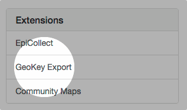
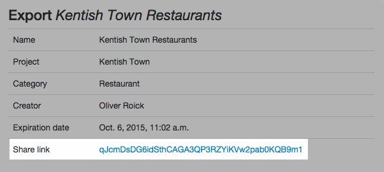
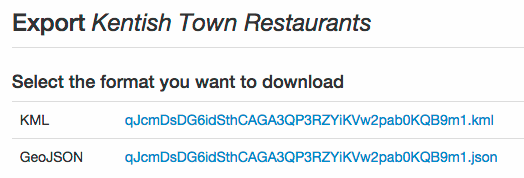

_geokey-export_ is an extension to export data to various formats and to share the data for import to third-party applications.

### Create an export

Creating a new exports requires just a few steps:

1. Head to the extension. From your GeoKey dashboard, click _GeoKey Export_ in the list of extensions on the right-hand side.

    

2. The next page will show you a list of exports that you have created before. To create a new extension, click _Create new export_.

    

3. You will be presented with a form to create the export. Fill in the following fields:

  - **Name:** Provide a meaningful name here, so you can find your export again.
  - **Project:** Select the project, you want to export data from. You can only export data from projects that you an administrator of.
  - **Category:** Select a category that you want to export.
  - **Length of availability** This defines for how long your export will be available. By exporting data, you make it available the general public—anyone with the link can access the data. Please choose wisely.
    - _one off:_ The export can be accessed by one person only. After the export has been accessed, the link will expire.
    - _one week:_ The export will be available for one week from the date it has been created.
    - _permanent:_ The export will not expire.

Click _Create export_ to finish up. You will be redirected to an overview of the export that you have just created.

### Share the export

The overview of the export provides a link that you can use to access exported data and to share data with others—simply copy the link and send it in an email.

The link provides a list of different formats that are available for the export. By clicking on any of the links, you will get access to exported data in the corresponding format.

